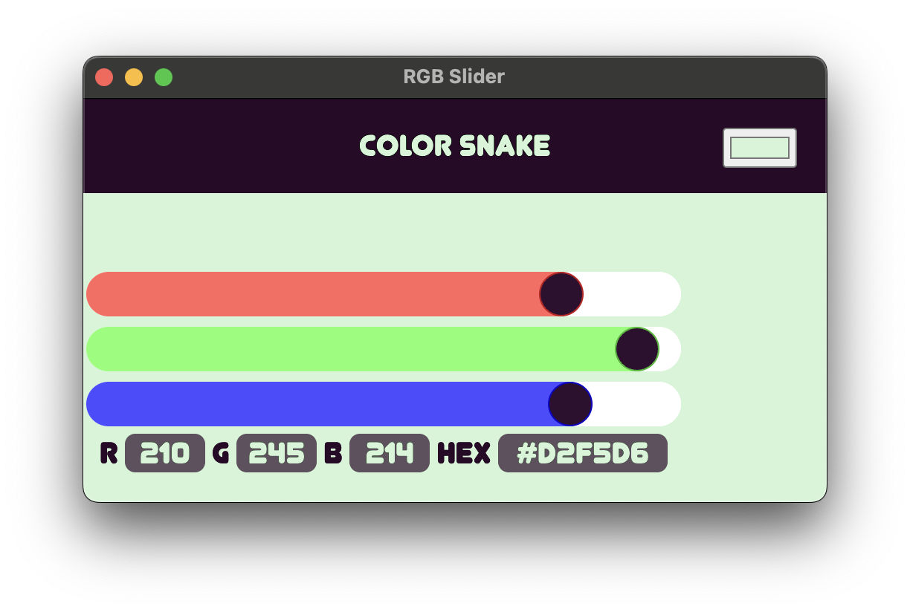

# colorsnake_electron
deskop color picker app, made with web languages and packaged with electron


THIS APP IS A PART OF THE COLOR SNAKE PROJECT BY NATHAN RENFROE & THE SUNSHINING
BUILT WITH HTML, CSS AND JS.
PACKAGED FOR DESKTOP WITH ELECTRON.


---

Hi, since I primarily use mac os, I have it set up so that I can easily package for mac os, I don't like to develop for other platforms since I can't test it on those other platforms.
Since this is an electron app, you can clone it and build it yourself!
I use yarn, but am playing around with different package managers, and electron-builder to build.
cd into app base folder to run install and start commands!
(If you get an error remove the "packageManager" line from the package.json.)


I also kept this app very basic and did not customize the menu or anything.
I currently have no road map to add more features.


**build yourself**

```sh
git clone https://github.com/color-snake/colorsnake_electron
cd colorsnake_electron/appBASE
yarn install # To install dependencies
yarn start # To start app
yarn mac # To package for mac
# You can also package for other operating systems, but I don't have easy commands set up for that.
```